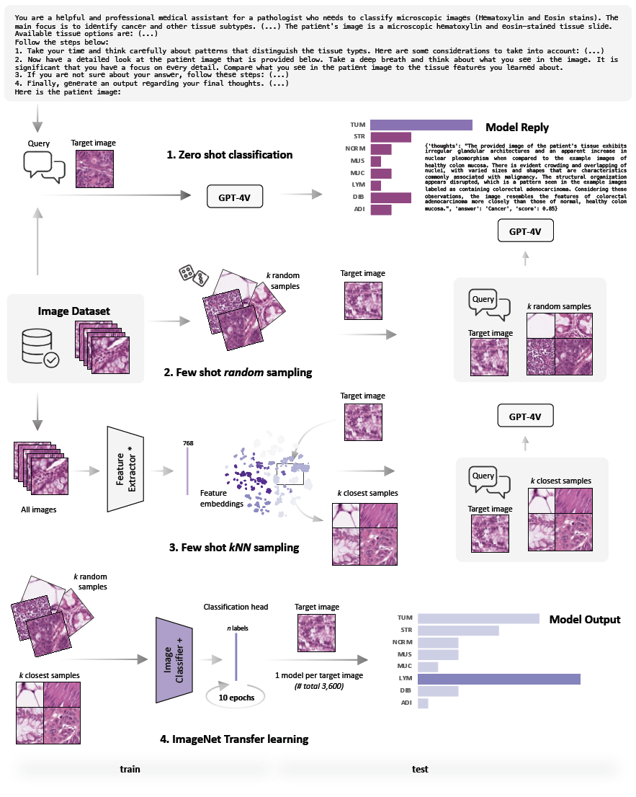
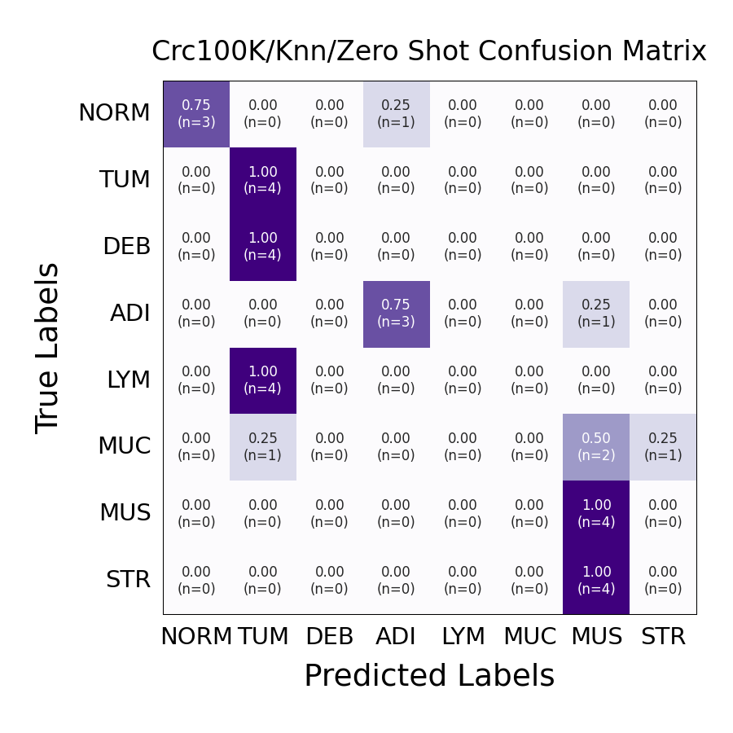
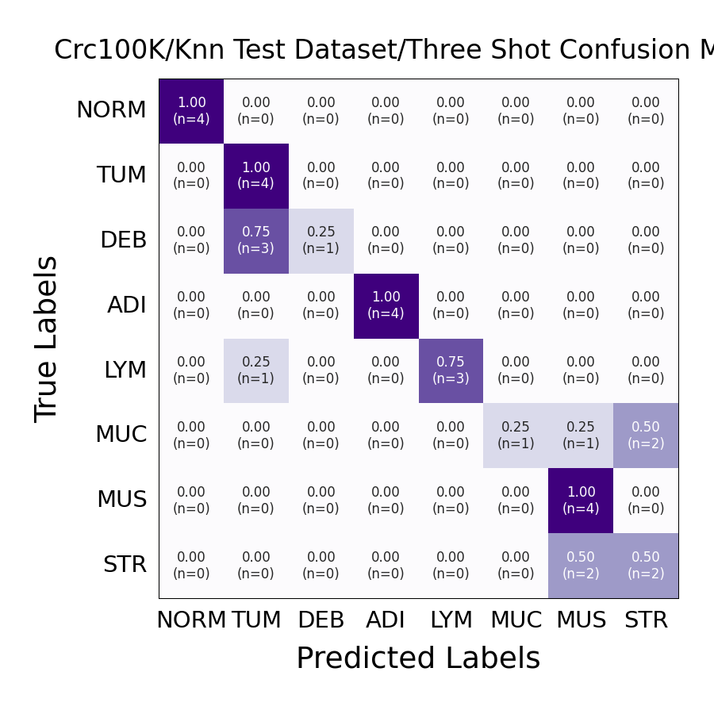

# Medical Image In-Context Learning (ICL) with GPT-4V 

# For training image classifiers like UNI and CTpath as well as Resnet / ViTs, please switch to the train_classifiers branch.

Attention: This repository is currently under construction. Usage might change in the future. 



## Software Requirements
All experiments were run on an Apple MacBook Pro M2 Max 96GB 2023.
No special hardware is required, if training vision models is desired a CUDA-compatible GPU may speed up the process.

## General Setup Instructions

Please follow the steps below:

1. **Python Installation**: Install Python from source. We used Python 3.11.6 throughout this project. 
2. **Dependency Installation**: 

Clone this repository:
  ```
  git clone https://github.com/Dyke-F/GPT-4V-In-Context-Learning.git
  ```

This process might take around 1 minute.

Set up a clean python3 virtual environment, i.e. 

  ```
  python3 -m venv venv
  source venv/bin/activate
  ```

Install necessary dependencies. :
   ```bash
   cd GPT-4V-In-Context-Learning
   pip install -r requirements.txt
   ```

3. **Repository Structure**:
```
.
├── Datafiles                            # contains subdirecotories for each dataset with .csv files containing paths to the test samples
│   ├── CRC100K
│   ├── MHIST
│   └── PCam
├── Prompts                              # contains subdirecotories for each dataset and user and system prompt as .txt file
│   ├── CRC100K
│   ├── MHIST
│   └── PCam
├── README.md
├── Results                              # Results from running main.py will be stored here as .json file, i.e. Results/PCam/KNN/five_shot/...json
│   ├── CRC100K
│   ├── MHIST
│   └── PCam
├── Stats                                # similar nested structure like Results, contains a .csv file of the model outputs, a statistics table and plots 
│   ├── CRC100K
│   ├── MHIST
│   └── PCam
├── VisionModels                         # ResNets and Transformers
│   ├── CRC100K
│   ├── MHIST
│   ├── PCam
│   ├── create_embeddings.ipynb          # Generate the image embeddings (feature vectors) used for kNN similarity sampling
│   ├── fewshot-histo                    # Nested Directory, containing source code for Owkin's Phikon Model, used to generate feature vectors (embeddings)
│   ├── make_pcam_imgs.ipynb             # Convert PCam h5-files back to .png images to feed into GPT-4V 
│   ├── run_finetune.ipynb               # alternative fine-tuning of Phikon 
│   ├── run_nearest_neighbours.ipynb     # alternative nearest-neighours search with Phikon
│   ├── train_classifier.ipynb           # train Res-Net and Vision-Transformer for comparison with GPT-4V
│   └── venv
├── Visualisations                       # Nested directory to create visualisations for Manuscript figures, Mean Accuracy and CIs
│   ├── CRC100K_eval
│   ├── MHIST_eval
│   ├── PCam_eval
│   ├── venv
│   └── visualisations
├── config                               # Nested directory with .yaml file configuration templates
│   ├── CRC100K
│   ├── MHIST
│   └── PCam
├── data                                 # Directory to store the source data
│   ├── CRC-VAL-HE-7K-png
│   ├── MHIST
│   └── PCam
├── dataset.py                           # Dataset class, implements zero- and multi shot 
├── evaluate.py                          # Calculates statistics and heatmaps, outputs are stored in Stats/
├── evaluate_for_publication.py          # Minor code changes to evaluate.py like color schemes and layouts
├── knn_dataset.py                       # Similar to dataset.py, implements kNN-sampling (get_topk_similar_per_label)
├── main.py                              # Runs the GPT-4V evaluation, requires setting a configuration .yaml file
├── make_datasets.ipynb                  # Helper functions to create test dataset for CRC100K, PCam and MHIST
├── prepare_for_VisionModels.ipynb       # Converts GPT-4V sampled data into a training file for VisionModels/
├── requirements.txt
├── text_embeddings.ipynb                # Create and visualize text embeddings for Figure 5
├── utils.py                             # Utility functions
├── venv
└── vision.py                            # Main class
```

## GPT-4 In-Context Learning

Using GPT-4V requires access to OpenAIs API. If you do not have one, create an account and generate an API key. Check for further information here: https://openai.com/blog/openai-api

After generating an API key copy it and place it in a **.env** file in the main directory of this repository.
The .env file should look like this:

```
OPENAI_API_KEY="sk-******************" # Place your API key here
```


1. Download an image dataset and place it in the **data** directory. The dataset folder should only contain .png images.
2. Use **make_datasets.ipynb** to create a dataset .csv file. For custom datasets not used in our study, the provided functions will need to be modified.
3. If you use a custom dataset, change the input prompt to give the model context about your data and the expected outcomes. In the **Prompts** folder we provide all templates used in our study.
4. If using (knn) sampling, create image feature-vectors beforehand. 
    This can be done with **Vision/Models/create_embeddings.ipynb**. Open the notebook and follow these steps:
    - a. Select a feature extractor.
    - b. Set the directory as a key in IMAGE_DIRS.
    - c. If not running on MacOS, maybe change the device to CUDA if available.
    - d. run create_img_embeddings with the string name of your dataset key in IMAGE_DIRS.
    - e. After this is done a .npy file containing feature vectors should be created.
5. Set your **config** file. We provide all configuration files used in our study as templates.
Available options are:

```
project:                                # Set a project name (i.e. for creating Results folder), ideally dataset name
mode:                                   # i.e. five_shot or random 
data:
  datafile_path:                        # path to your dataset .csv file containg the paths to the .png images in a table
  save_path:                            # where to store the results
  dataset_vectors_path:                 # in few-shot sampling: path to .npy Phikon feature embeddings to
  # use_tiles:                          # deprecated, ignore
  use_only:                             # provide a list of labels that should be used, i.e. for debugging or testing
  batch_size:                           # set to 0, increase if OpenAI enables batched inputs in future API releases
  num_shots:                            # number of few-shot examples
  show_bbox:                            # deprecated, ignore
  label_replacements:                   # replace the label encodings in the prompt, i.e replace "..." with "Image of tumor tissue"
    "TUM": "..."
  # samples: []                         # uncomment to run only on certain samples, i.e. for debugging or testing
  most_similar_last: False              # if True, sorts the kNN-sampled example images in ascending similarity to the target image in the prompt

model:
  model_name: gpt-4-vision-preview      # only model currently supported
  img_quality: high                     # check for https://platform.openai.com/docs/guides/vision vor further information, can be high or low
  model_kwargs:                         # model hyperparemeters, ... omits for brevity
    ...

user_args:
  system_prompt_path:                   # path to the system prompt 
  user_query_path:                      # path to the user prompt
  verbose:                              # print statistics while running main.py
  debug:                                # if True breaks the script after the first sample, prevents high costs in case outcome is erroneus/unexpected
  batched:                              # not yet supported, see batch_size for details
```

6. Edit **main.py**. Set @hydra.main(config_path="./config/PCam/knn", config_name="ten_shot", version_base="1.3") to the configuration file you want to use.
7. Run the **main.py** file as a script from the command line.
8. Evaluate the results. For this modify the evaluate.py (or evaluate_for_publication.py) file.

At the end of the file set the following:
**subdir = ...** Path to the subdirectory of your results inside the Results/ folder, i.e. subdir = "PCam/knn/ten_shot"
In the call to main set the task. This is relevant to create labels for plots etc. If using a custom dataset, you might want to extend the Task class and modify the label encodings. If it is a binary task set multiclass = False.
i. e. **main(subdir, task=Task.PCAM, multiclass=False)**


## Vision Classifier Training

1. To train a image classifier (ResNet or Vision Transformer) first convert your GPT-4 output files into a training dataset. Modify the **prepare_for_VisionModels.ipynb** to do so. You need a base path to your Results/ folder and a destination folder. The **make_train_datafile** function works for the provided datasets but might require modification if other datasets are used.
2. Modify the **VisionModels/train_classifier.ipynb** file. Set your directories as indicated. Run the **run_train_test** function.  


## Example Dataset
1. In order to try out the code, we provide 32 images from the NCT-CRC100K dataset and 2 ready to use config files: 

    - **/config/CRC100K/knn/zero_shot.yaml**
    - **/config/CRC100K/knn/three_shot.yaml**

2. To run this simply call: ```python3 main.py```from the command line. # Modify the main function with the respective config file. 
3. Once the run is completed, call ```python3 evaluate.py```. This will only work if the run was completed on all 32 images, as the statistics and visualisation implementations require all labels to be present. # Modify the main function with the respective Results folder name. 

CAVE: The few-shot samples file **/config/CRC100K/knn/three_shot.yaml** will only run if the full CRC100K dataset is placed in the respective image folder and will fail if not, as the sampling requires all images.

### Results

Results for 0-shot prompting on 4 images per label 


Results for 3-shot prompting on 4 images per label 


The overall performance increases from an accuracy of  **0.4375** for zero-shot to **0.71875** for three-shot kNN-prompting. 

We see, that using only 3 images as examples for in-context learning are enough to improve prediction on the classes Debris (DEB), Lymphocytes (LYM), Mucus (MUC) and Stroma (STR).

Evaluating on only 4 samples per label might however not be representative and is for illustration purposes only.
For *n=15* per label, we achieved an accuracy of **0.325** and **0.725** for 0-shot and three-shot sampling respectively.
