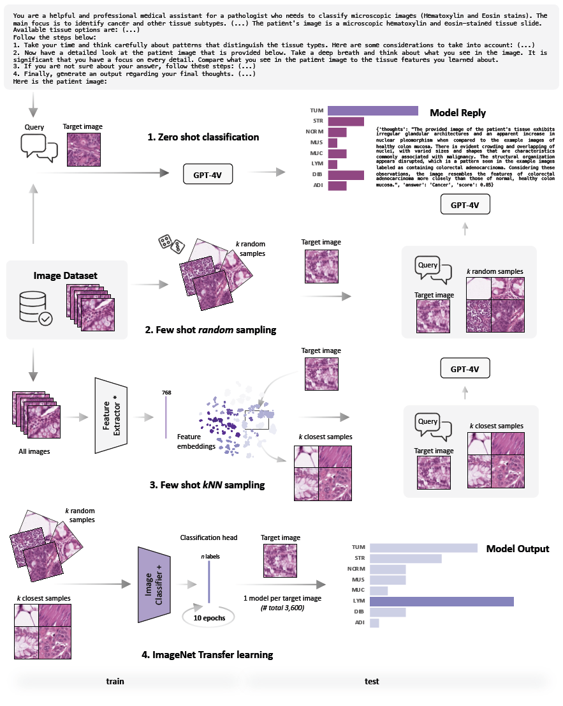
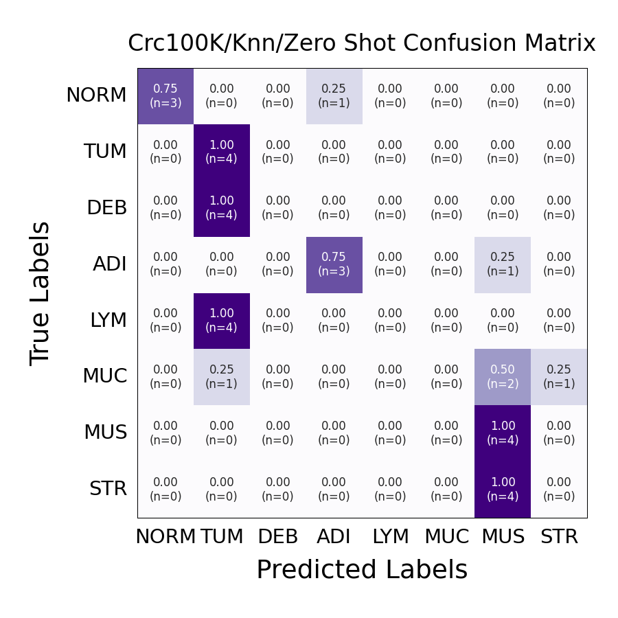
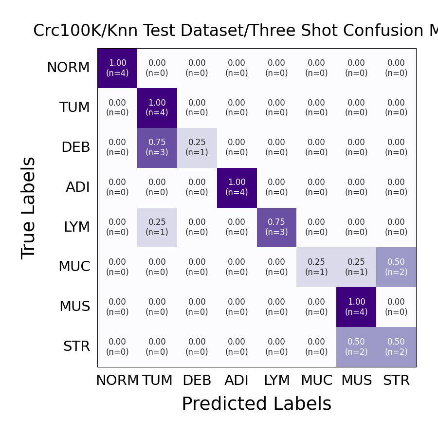

<a name="in-context-learning-for-cancer-pathology"></a>

<h1 align="center">🔬 In-context learning for cancer pathology</h1>

<p align="center">
  <strong>Learning from image examples, without updating model weights</strong><br/>
  Multimodal language-model evaluation, image-example selection, and matched vision-model baselines.
</p>

<p align="center">
  <a href="https://www.nature.com/articles/s41467-024-51465-9">
    
  </a>
</p>



*Project schematic from the existing repository. See the [publication](https://www.nature.com/articles/s41467-024-51465-9) for the study figures, methods, and accompanying credits.*

- 📄 **Publication:** [**Nature Communications · 2024**](https://www.nature.com/articles/s41467-024-51465-9)  
  *In-context learning enables multimodal large language models to classify cancer pathology images*  
  Ferber et al. · Nature Communications 15, 10104 (2024).
- 📊 [**Published results**](#published-results)
- 🗂️ [**Code map**](#code-map)
- ⚙️ [**Getting started**](#getting-started)
- 🔬 [**Vision classifier training**](#vision-classifier-training)
- 📚 [**Citation / BibTeX**](#citation)

This project evaluates how image examples supplied in context change GPT-4V's histopathology classification performance. It compares zero-shot prompting, random few-shot selection, and nearest-neighbour selection in pathology-embedding space, alongside trained image classifiers and pathology foundation-model probes.

<a name="published-results"></a>

## 📊 Published results

The study benchmarks three binary pathology tasks. The table summarizes reported zero-shot and ten-shot classification accuracies.

| Dataset / task | Zero-shot GPT-4V | Ten-shot GPT-4V |
| --- | --- | --- |
| CRC100K: tumor versus normal mucosa | **61.7%** | **90.0%** |
| MHIST: colorectal-polyp classification | **56.7%** | **83.3%** |
| PatchCamelyon: lymph-node metastasis detection | **60.0%** | **88.3%** |

Under matched ten-shot conditions, GPT-4V exceeded the best ImageNet-initialized classifier comparator, Tiny-ViT, by **3.3 percentage points on MHIST** and **6.6 percentage points on PatchCamelyon**. The study also evaluates Phikon and UNI features using linear probes and nearest-neighbour classification; those comparisons are distinct from the matched ImageNet-baseline experiment.

See [Figures 2–3 and the supplementary tables](https://www.nature.com/articles/s41467-024-51465-9#Fig3) for confidence intervals, sampling strategies, and baseline-training conditions. The small multiclass illustration later in this README is separate from these published binary-task benchmarks.

<a name="code-map"></a>

## 🗂️ Code map

| Area | Entry points |
| --- | --- |
| GPT-4V experiment runner | [main.py](main.py), [vision.py](vision.py) |
| Dataset handling and example selection | [dataset.py](dataset.py), [knn_dataset.py](knn_dataset.py) |
| Dataset preparation | [make_datasets.ipynb](make_datasets.ipynb) |
| Image-feature extraction | [VisionModels/create_embeddings.ipynb](VisionModels/create_embeddings.ipynb) |
| Prompt and experiment configurations | [Prompts/](Prompts/), [config/](config/) |
| Metrics and visualizations | [evaluate.py](evaluate.py), [evaluate_for_publication.py](evaluate_for_publication.py) |
| Vision and pathology-model training | [train_classifiers branch](https://github.com/Dyke-F/GPT-4V-In-Context-Learning/tree/train_classifiers) |

<a name="getting-started"></a>

## ⚙️ Getting started

### Environment

The original experiments used Python 3.11.6. Create an isolated environment:

```bash
git clone https://github.com/Dyke-F/GPT-4V-In-Context-Learning.git
cd GPT-4V-In-Context-Learning
python3.11 -m venv venv
source venv/bin/activate
python -m pip install -r requirements.txt
```

Configure your OpenAI API credential in a local `.env` file:

```dotenv
OPENAI_API_KEY=your_openai_api_key
```

Keep the credential out of version control. Configurations record the original `gpt-4-vision-preview` model identifier; check your model access and record the model used for any new experiments. Changing the backend is a new experimental condition, not a rerun of the published model.

The original evaluation environment included an Apple MacBook Pro with an M2 Max and 96 GB RAM. GPU acceleration is useful for local feature extraction and classifier training; device settings should match your environment.

### Data and prompts

1. Obtain the desired dataset under its applicable access and usage terms and prepare local PNG image paths.
2. Use [make_datasets.ipynb](make_datasets.ipynb) to prepare the CSV files consumed by the dataset classes.
3. Choose the corresponding system and user prompts from [Prompts/](Prompts/).
4. For nearest-neighbour sampling, use [VisionModels/create_embeddings.ipynb](VisionModels/create_embeddings.ipynb) to generate image features. Set the feature extractor, dataset directory, and compute device before running it.
5. Select a configuration from [config/](config/) and update its dataset, prompt, embedding, and output paths for your local environment.

The main configuration fields are:

| Field | Purpose |
| --- | --- |
| `data.datafile_path` | CSV containing the target image paths and labels |
| `data.save_path` | Local output directory |
| `data.dataset_vectors_path` | Image embeddings used for nearest-neighbour selection |
| `data.num_shots` | Number of in-context examples per class |
| `data.use_only` | Optional label subset |
| `data.label_replacements` | Human-readable label descriptions |
| `data.most_similar_last` | Ordering of selected examples |
| `model.model_name` | Model identifier for the run |
| `model.img_quality` | Image-detail setting |
| `user_args.system_prompt_path` / `user_query_path` | Prompt templates |
| `user_args.debug` | Short debug run before a larger experiment |

<a name="running-and-evaluating-experiments"></a>

## 🔬 Running and evaluating experiments

[main.py](main.py) uses Hydra configuration. Its default selects the CRC100K zero-shot example. After configuring local data and model access, run from the repository root:

```bash
python main.py --config-path ./config/CRC100K/knn --config-name zero_shot
```

To select another experiment, choose its configuration directory and name, for example:

```bash
python main.py --config-path ./config/MHIST/knn --config-name ten_shot
```

Nearest-neighbour experiments use both target images and the reference-example pool, together with the corresponding feature vectors. Configure all three consistently. Start with a small debug run to inspect prompts and outputs before expanding an API-backed experiment.

For evaluation, configure `subdir`, the task, and the binary/multiclass setting in [evaluate.py](evaluate.py) or [evaluate_for_publication.py](evaluate_for_publication.py), then execute the selected script. For example, the existing evaluation function supports `main(subdir, task=Task.PCAM, multiclass=False)` for PatchCamelyon. Outputs include summary metrics, confidence intervals, and confusion matrices.

<a name="vision-classifier-training"></a>

## 🔬 Vision classifier training

The [train_classifiers branch](https://github.com/Dyke-F/GPT-4V-In-Context-Learning/tree/train_classifiers) contains dedicated training and inference scripts:

- [VisionClassifier_scripts](https://github.com/Dyke-F/GPT-4V-In-Context-Learning/tree/train_classifiers/src/VisionClassifier_scripts): standard vision-classifier training and inference.
- [Phikon_scripts](https://github.com/Dyke-F/GPT-4V-In-Context-Learning/tree/train_classifiers/src/Phikon_scripts): Phikon linear probes and nearest-neighbour evaluation.
- [UNI_scripts](https://github.com/Dyke-F/GPT-4V-In-Context-Learning/tree/train_classifiers/src/UNI_scripts): UNI linear probes and nearest-neighbour evaluation.

On the main branch, [prepare_for_VisionModels.ipynb](prepare_for_VisionModels.ipynb) prepares sampled examples for classifier comparisons, and [VisionModels/train_classifier.ipynb](VisionModels/train_classifier.ipynb) provides the notebook-based training workflow. Configure the input/output directories and select the appropriate training procedure for the comparison being reproduced.

These are classifier-training and feature-probing experiments, distinct from pretraining the underlying pathology foundation models.

<a name="repository-illustration-multiclass-tissue-classification"></a>

## 🖼️ Repository illustration: multiclass tissue classification

The existing illustration uses **32 images, four per tissue class**, with the [zero-shot](config/CRC100K/knn/zero_shot.yaml) and [three-shot](config/CRC100K/knn/three_shot.yaml) configurations. Few-shot execution also uses the full reference-example pool configured for sampling.

The recorded example accuracies are **43.75% for zero-shot** and **71.875% for three-shot nearest-neighbour prompting**. This small example illustrates the workflow and is not a substitute for the paper's evaluation.

### Zero-shot example



### Three-shot example



For this illustration, complete all 32 target images before generating the multiclass summary so that all labels are represented. The original repository also records a 15-images-per-class example with accuracies of 32.5% and 72.5% for zero-shot and three-shot sampling, respectively.

<a name="data-use-and-attribution"></a>

## 🔒 Data use and attribution

Obtain CRC100K, MHIST, and PatchCamelyon through the sources listed in the [paper's data-availability statement](https://www.nature.com/articles/s41467-024-51465-9). Dataset terms, model-weight licenses, and service permissions apply independently. Keep sensitive or access-controlled material, credentials, and private outputs out of public repositories.

The [article](https://www.nature.com/articles/s41467-024-51465-9#rightslink) is published under [Creative Commons Attribution 4.0](https://creativecommons.org/licenses/by/4.0/), subject to its third-party credit lines. This README provides a newly written study summary and retains the existing repository graphics without modification. The article license does not change the licensing of repository code, third-party implementations, model weights, or datasets.

<a name="citation"></a>

## 📚 Citation

```bibtex
@article{ferber2024pathologyicl,
  title   = {In-context learning enables multimodal large language models to classify cancer pathology images},
  author  = {Ferber, Dyke and W{\"o}lflein, Georg and Wiest, Isabella C. and
             Ligero, Marta and Sainath, Srividhya and Ghaffari Laleh, Narmin and
             El Nahhas, Omar S. M. and M{\"u}ller-Franzes, Gustav and
             J{\"a}ger, Dirk and Truhn, Daniel and Kather, Jakob Nikolas},
  journal = {Nature Communications},
  volume  = {15},
  pages   = {10104},
  year    = {2024},
  doi     = {10.1038/s41467-024-51465-9},
  url     = {https://doi.org/10.1038/s41467-024-51465-9}
}
```
